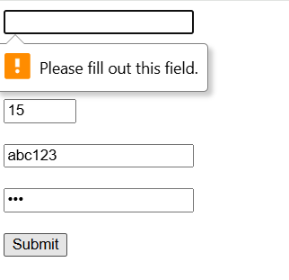
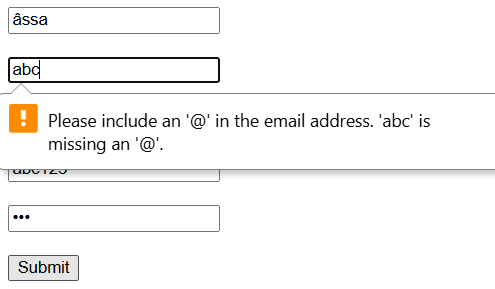
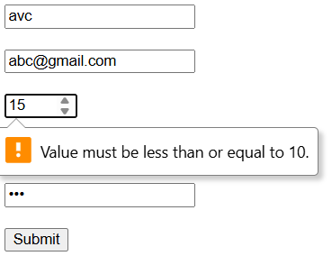
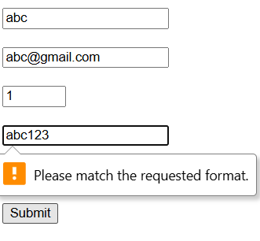
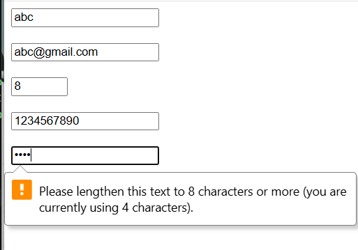

# Phần A:
## Câu A1:
1. type="email": Ô nhập text, tự kiểm tra có @. Dùng cho đăng ký tài khoản
2. type="password": Hiển thị ký tự dạng dấu chấm. Dùng cho đăng nhập
3. type="number": Ô nhập số, có nút tăng/giảm. Dùng nhập số lượng sản phẩm
4. type="tel": Ô nhập số điện thoại. Dùng nhập SĐT giao hàng
5. type="url": Kiểm tra định dạng link. Dùng nhập website người bán
6. type="date": Hiển thị lịch chọn ngày. Dùng chọn ngày giao hàng
7. type="radio": Chọn 1 trong nhiều. Dùng chọn phương thức thanh toán
8. type="checkbox": Chọn nhiều. Dùng chọn nhiều sản phẩm/lọc
9. type="file": Chọn file upload. Dùng upload ảnh đánh giá
10. type="search": Ô tìm kiếm có nút xóa nhanh. Dùng thanh search sản phẩm

## Câu A2:
<!-- Trường hợp 1 -->
`<input type="text" required value="">`   <!-- User để trống --> Không submit được. Vì required mà để trống thì trình duyệt báo lỗi.

<!-- Trường hợp 2 -->
`<input type="email" value="abc">`        <!-- User gõ "abc" --> Không submit được. Vì không đúng định dạng email (thiếu @).

<!-- Trường hợp 3 -->
`<input type="number" min="1" max="10" value="15">` <!-- User gõ 15 --> Không submit được. Vì 15 > max (10).

<!-- Trường hợp 4 -->
`<input type="text" pattern="[0-9]{10}" value="abc123">` <!-- User gõ "abc123" --> Không submit được. Vì không đúng regex (phải 10 số)

<!-- Trường hợp 5 -->
`<input type="password" minlength="8" value="123">`  <!-- User gõ "123" --> Không submit được. Vì độ dài < 8

## Câu A3:
1. `<label for="email">` quan trọng cho người dùng screen reader vì screen readser đọc trang web theo ngữ cảnh. Khi focus vào input, trình đọc sẽ thông báo tên label đi kèm (nhờ thuộc tính for khớp với id), giúp người khiếm thị biết họ đang nhập liệu vào đâu. Ngoài ra, click vào label sẽ tự động focus vào input, tăng trải nghiệm người dùng (UX).
2. `<fieldset> + <legend>`: Dùng để nhóm các input có liên quan logic. 
- Ví dụ: Nhóm các radio button chọn phương thức vận chuyển: "Nhanh", "Tiết kiệm", "Hỏa tốc". 
- Cấu trúc: `<fieldset><legend>` Chọn phương thức vận chuyển`</legend>` ...radio buttons... `</fieldset>`
3. aria-label: Dùng khi không có văn bản hiển thị trực quan (visual label) để mô tả cho component. 
- Ví dụ: Nút tìm kiếm chỉ có icon kính lúp, cần aria-label="Tìm kiếm" để screen reader hiểu nút này làm gì.
- Không dùng khi đã có `<label>` vì gây trùng lặp, screen reader đọc 2 lần.

## Câu A4:
- loading="lazy": Trì hoãn việc tải ảnh cho đến khi ảnh tiến gần đến viewport (màn hình) của người dùng.
 + Cải thiện: Tăng tốc độ tải trang ban đầu (LCP - Largest Contentful Paint), tiết kiệm băng thông.
 + Không dùng cho ảnh ở "above-the-fold" (ảnh ở ngay đầu trang, thấy ngay khi vừa tải), vì nó sẽ làm ảnh hiện chậm hơn.
- Nhiều `<source>` trong `<video`>: Để đảm bảo trình duyệt nào cũng chạy được video. 3 format phổ biến: MP4 (H.264), WebM (VP9/AV1), Ogg (Theora).
- Thuộc tính alt dùng để mô tả ảnh cho screen reader hiển thị khi ảnh lỗi.
 + Iphone 16: alt="iPhone 16 Pro Max 256GB màu Titan"
 + Trang trí: alt=""
 + Biểu đồ: alt="Biểu đồ cột thể hiện doanh thu Q1/2026, tăng trưởng 10% so với cùng kỳ năm trước"

 ## Câu A5:
 - Cách 1 ``: Dùng khi ảnh là một thành phần độc lập, mang tính trang trí hoặc không cần chú thích đi kèm.
    Ví dụ: ảnh avatar user, ảnh sản phẩm,...
- Cách 2 `<figure> + <figcaption>`: Dùng khi hình ảnh là một phần của nội dung, cần một lời giải thích (caption) đi kèm để ngữ cảnh được trọn vẹn. Nó tạo thành một khối thông tin thống nhất.
    Ví dụ: Ảnh sản phẩm kèm giá/tên, biểu đồ trong bài báo cần tiêu đề giải thích biểu đồ đó.

# Phần B:
## Bài B1:
HTML không thể tự kiểm tra "confirm password" vì:
- HTML validation chỉ kiểm tra từng input riêng lẻ
- Không thể so sánh giá trị giữa 2 input (password vs confirm)
- Muốn kiểm tra phải dùng JavaScript
=> Hạn chế của HTML5 validation

# Phần C:
## Câu C1:
- Lỗi 1: Input "Tên" không có label
    Sửa: `<label for="name">`Tên:`</label> <input type="text" id="name" name="name" required>`
- Lỗi 2: Email không có name và label
    Sửa: `<label for="email">`Email:`</label> <input type="email" id="email" name="email" required>`
- Lỗi 3: Password không có validation
    Sửa: thêm minlength="8"
- Lỗi 4: Không validate confirm password
    ửa: cần JS để so sánh
- Lỗi 5: Phone dùng type="text"
    Sửa: `<input type="tel" pattern="[0-9]{10}">`
- Lỗi 6: Phone có value mặc định (không nên)
    Sửa: bỏ value
- Lỗi 7: Select không có label
    Sửa: `<label for="city">`Thành phố:`</label>`
- Lỗi 8: Checkbox không có input
    Sửa:
    `<label>`
    `<input type="checkbox" required>`
    Tôi đồng ý điều khoản
    `</label>`

## Câu C2: 
1. Viết pattern regex:
- CMND/CCCD (12 chữ số liên tiếp): pattern="[0-9]{12}"
- Số tài khoản (từ 10 đến 15 chữ số): pattern="[0-9]{10,15}"
2. HTML5 validation chưa đủ an toàn cho ứng dụng ngân hàng. Vì chỉ validate phía client, user có thể bypass, không bảo mật dữ liệu.
3. 3 thứ HTML không làm được: 
    - So sánh 2 field (confirm password).
    - Kiểm tra tồn tại email (database).
    - Logic phức tạp (OTP, captcha).
4. Hai rủi ro bảo mật lớn nếu chỉ validate trên Frontend:
    - Tấn công: Kẻ tấn công có thể gửi các đoạn mã độc thông qua các trường nhập liệu để phá hủy cơ sở dữ liệu hoặc đánh cắp thông tin người dùng khác.
    - Sai lệch dữ liệu: Dữ liệu rác hoặc sai định dạng sẽ được lưu vào hệ thống, dẫn đến việc xử lý lỗi phần mềm ở máy chủ hoặc làm hỏng hệ thống báo cáo.

## Phần D: Video OBS
https://drive.google.com/file/d/1sWu_UGKVO7TJTa-Lqdx-wruXbRcEPlmm/view?usp=sharing